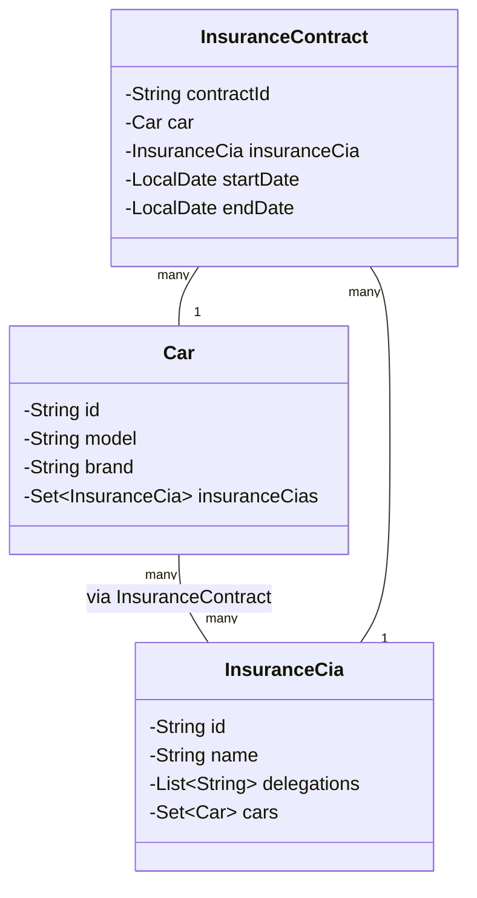

# PRA01-02-03: Implementing ManyToMany Relationships and ElementCollection in JPA for RentingCarTest

## CIFO La Violeta - FullStack IFCD0021-1-25 MF01-02-03

- doc version: `v3`

In this practical exercise, you will enhance the `RentingCarTest` project by refactoring the `Car` and `InsuranceCia` relationship from a `OneToMany` to a `ManyToMany` relationship using a bridge entity called `InsuranceContract`.

Additionally, you will implement an `@ElementCollection` for the `Delegations` attribute in the `InsuranceCia` entity. The project uses **Spring Boot**, **Spring Data JPA**, and an **H2 in-memory database**.

<mark>You'll design, implement, and test the refactored relationship using an H2 database</mark> and `JpaRepository`, with a focus on the automatic creation of a <mark>join table</mark> via the `InsuranceContract` entity and proper handling of the `@ElementCollection` for `Delegations`.

## Objectives

> Refactor the `Car` and `InsuranceCia` relationship to a `ManyToMany` using the `InsuranceContract` bridge entity, implement the `@ElementCollection` for `Delegations` in `InsuranceCia`, and test the implementation using JUnit. Create a UML diagram to represent the relationships.

### Project Base

- Existing Repository: [GitHub - AlbertProfe/rentingCarTest](https://github.com/AlbertProfe/rentingCarTest)
- Existing Repository <mark>/docs</mark>: [RentingCarTest](https://github.com/AlbertProfe/rentingCarTest/tree/master/docs)
- Commit to Clone: [Commit 63515bf](https://github.com/AlbertProfe/rentingCarTest/tree/6ae4c0771e5d96237ecafa0c9275cbe2e12a7954)
- Official Course: [IFCD0021-1-25](https://albertprofe.dev/ifcd0021-1-25/ifcd0021-1-25.html)
- Mermaid Documentation: [Mermaid.js](https://mermaid.js.org/intro/)
- Reference Lab: [Spring Boot Lab 8.3](https://albertprofe.dev/springboot/sblab8-3.html)
- Reference Lab: [Spring Boot Lab 8.4](https://albertprofe.dev/springboot/sblab8-4.html)
- Spring Data JPA Documentation: [Spring Data JPA](https://docs.spring.io/spring-data/jpa/docs/current/reference/html/)

### Tasks

Summary tasks:

- [ ] Create UML Diagram (PRA01)
- [ ] Implement `@ElementCollection` for `Delegations` (PRA02)
- [ ] Refactor `Car` and `InsuranceCia` to `ManyToMany` with `InsuranceContract` (PRA03)
- [ ] Implement JPA Repositories (PRA02, PRA03)
- [ ] Populate `InsuranceContract` Table (PRA03)
- [ ] Write JUnit Tests (PRA02, PRA03)
- [ ] Configure H2 Database (PRA02, PRA03)

Tasks:

1. **Create UML Diagram (PRA01 - Group Task)**
   
   - Create a UML diagram using **Mermaid** to represent the `ManyToMany` relationship between `Car` and `InsuranceCia` through the `InsuranceContract` bridge entity.
   - Include the `@ElementCollection` for `Delegations` in `InsuranceCia`.
   - Submit the diagram as part of the pull request.

2. **Implement `@ElementCollection` for `Delegations` (PRA02 - Group Task)**
   
   - Add a `List<String>` field called `delegations` to the `InsuranceCia` entity, annotated with `@ElementCollection`.
   - Each string in the list should represent a delegation's name and address, separated by `\n` (e.g., `"Barcelona Office\nCarrer de Balmes, 123"`).
   - Ensure the collection is stored in a separate table automatically created by Hibernate.

3. **Refactor `Car` and `InsuranceCia` to `ManyToMany` with `InsuranceContract` (PRA03 - Group Task)**
   
   - Refactor the existing `OneToMany` relationship between `Car` and `InsuranceCia` to a `ManyToMany` relationship using the `InsuranceContract` bridge entity.
   - Use appropriate JPA annotations such as `@ManyToMany` and `@JoinTable` for the relationship.
   - Implement the `InsuranceContract` entity to manage the relationship, including attributes like `contractId`, `car`, `insuranceCia`, and **additional fields** like `startDate` and `endDate`.
   - <mark>Address infinite recursion issues</mark> in bidirectional relationships to prevent `StackOverflowError` using `@JsonIgnore`, `@JsonManagedReference`, or `@JsonBackReference`.

4. **Implement JPA Repositories**
   
   - Create or update JPA repository interfaces for `Car`, `InsuranceCia`, and `InsuranceContract`.
   - Ensure repositories support CRUD operations for managing the relationships.

5. **Populate `InsuranceContract` Table**
   
   - Write a service method or use a `CommandLineRunner` to populate the `InsuranceContract` table with sample data linking `Car` and `InsuranceCia` entities.
   - Ensure data consistency across the relationship.

6. **Write JUnit Tests**
   
   - Create JUnit tests for the `Car`, `InsuranceCia`, and `InsuranceContract` repositories.
   - Test the `ManyToMany` relationship and the `@ElementCollection` for `Delegations`.
   - Verify CRUD operations and data integrity.

7. **Configure H2 Database**
   
   - Set up the H2 in-memory database in `application.properties` or `application.yml`.
   - Configure Hibernate to automatically create the schema, including the join table for `InsuranceContract` and the collection table for `Delegations`.

#### Example InsuranceContract Entity

Below is a proposed example for the `InsuranceContract` entity:

```java
@Entity
public class InsuranceContract {
    @Id
    @GeneratedValue(generator = "UUID")
    @GenericGenerator(name = "UUID", strategy = "org.hibernate.id.UUIDGenerator")
    private String contractId;

    @ManyToOne
    @JoinColumn(name = "car_id")
    private Car car;

    @ManyToOne
    @JoinColumn(name = "insurance_cia_id")
    private InsuranceCia insuranceCia;

    private LocalDate startDate;
    private LocalDate endDate;

    // Default constructor
    public InsuranceContract() {
        this.contractId = UUID.randomUUID().toString();
    }

    // Constructors, getters, and setters
}
```

#### Example InsuranceCia Entity with @ElementCollection

Below is an example of how to implement the `@ElementCollection` for `Delegations` in the `InsuranceCia` entity:

```java
@Entity
public class InsuranceCia {
    @Id
    @GeneratedValue(generator = "UUID")
    @GenericGenerator(name = "UUID", strategy = "org.hibernate.id.UUIDGenerator")
    private String id;

    private String name;

    @ElementCollection
    @CollectionTable(name = "insurance_cia_delegations", joinColumns = @JoinColumn(name = "insurance_cia_id"))
    @Column(name = "delegation")
    private List<String> delegations = new ArrayList<>();

    @ManyToMany(mappedBy = "insuranceCias")
    @JsonIgnore
    private Set<Car> cars = new HashSet<>();

    // Default constructor
    public InsuranceCia() {
        this.id = UUID.randomUUID().toString();
    }

    // Constructors, getters, and setters
}
```

#### Example Car Entity

Below is an example of the refactored `Car` entity:

```java
@Entity
public class Car {
    @Id
    @GeneratedValue(generator = "UUID")
    @GenericGenerator(name = "UUID", strategy = "org.hibernate.id.UUIDGenerator")
    private String id;

    private String model;
    private String brand;

    @ManyToMany
    @JoinTable(
        name = "insurance_contract",
        joinColumns = @JoinColumn(name = "car_id"),
        inverseJoinColumns = @JoinColumn(name = "insurance_cia_id")
    )
    private Set<InsuranceCia> insuranceCias = new HashSet<>();

    // Default constructor
    public Car() {
        this.id = UUID.randomUUID().toString();
    }

    // Constructors, getters, and setters
}
```

### Defining options

**Unidirectional vs Bidirectional ManyToMany**

<mark>Explore the differences between unidirectional and bidirectional</mark> `ManyToMany` relationships:

- **Unidirectional**: Only one entity (`Car`) maintains the relationship with `@JoinTable`.
- **Bidirectional**: Both entities (`Car` and `InsuranceCia`) are aware of the relationship, with `mappedBy` on one side.

**Addressing Infinite Recursion**

Bidirectional relationships can cause infinite recursion during JSON serialization, leading to `StackOverflowError`. Use one of the following solutions:

1. **@JsonIgnore Annotation**
   
   - Apply `@JsonIgnore` to one side of the relationship (e.g., `InsuranceCia.cars`).
   - Prevents serialization of the annotated field.
   
   ```java
   @ManyToMany(mappedBy = "insuranceCias")
   @JsonIgnore
   private Set<Car> cars = new HashSet<>();
   ```

2. **DTO Pattern**
   
   - Use Data Transfer Objects (DTOs) to control API responses and avoid exposing the full entity graph.

3. **Custom Serialization**
   
   - Implement custom serializers for fine-grained control over JSON output.

4. **Lazy Loading**
   
   - Configure relationships with `FetchType.LAZY` to prevent loading related entities unless explicitly requested.

### Proposed UML Diagram (Mermaid)

Provide a UML diagram in **Mermaid** to represent the relationships, this one is a draft, improve it:



## Submission Guidelines

1. At local enviroment create a folder `MF01-03-Your-name` (`MF01-MF02-MF03-MarcPalau`) with two directories:
   
   1. `/docs`
   2. `/rentingCarTests`(do not create this folder, the clone command will craete it)

2. <mark>Clone</mark> the [RentingCarTest](https://github.com/AlbertProfe/rentingCarTest) repository at the specified commit [Commit 63515bf](https://github.com/AlbertProfe/rentingCarTest/tree/6ae4c0771e5d96237ecafa0c9275cbe2e12a7954) at your local folder `MF01-03-Your-name`.

3. Create a new branch named `PRA01-02-03` from the *cloned commit*.

4. **Update the code to implement the tasks** outlined above.

5. <mark>Commit</mark> your changes with clear, descriptive messages.

6. <mark>Push</mark> your branch to your personal GitHub repository.
   
   1. Create a zip file of your root folder project with:
      - the code project at /rentingCarTest
      - and the /docs:
        - .md` file summarizing your changes at root project:
        - Unidirectional vs Bidirectional ManyToMany
        - Addressing Infinite Recursion
        - Add to rootProject/docs/images **relevant** screenshots

7. <mark>Submit</mark> the zip file with`.md` files to the teacher via [IFCD0021-1-25 Deliveries](https://albertprofe.dev/ifcd0021-1-25/ifcd0021-deliveries-1-25.html).

## Evaluation Criteria

- Correct implementation of the `ManyToMany` relationship with the `InsuranceContract` bridge entity.
- Proper use of `@ElementCollection` for `Delegations` in `InsuranceCia`.
- Accurate UML diagram in Mermaid representing the relationships.
- Functionality of JPA repositories and data population in `InsuranceContract`.
- Quality and coverage of JUnit tests.
- Successful configuration of the H2 in-memory database.
- Proper handling of bidirectional relationships and infinite recursion issues.
- Overall code quality, organization, and documentation.

> Good luck with your implementation! 
> 
> Ensure thorough testing and clear documentation.