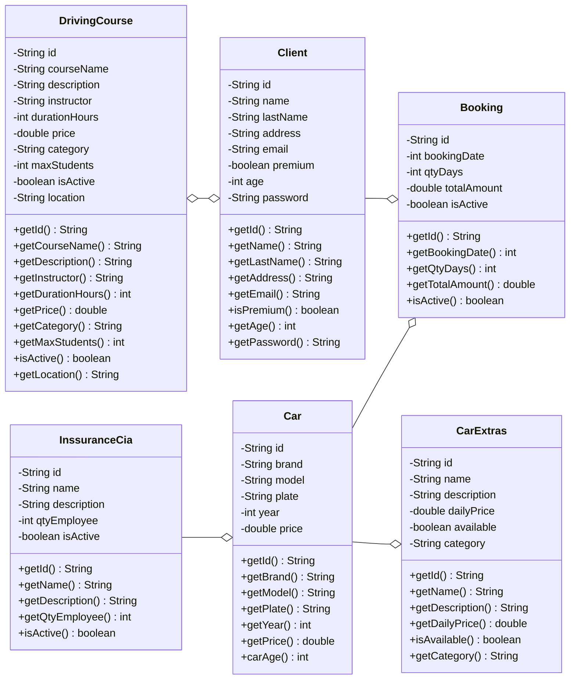

# rentingCar v2

`version document: v2.7`

## Goal & Summary

> Rent a car by CLI with client, car, init and ending date, price with Spring Boot

- Reference project: [Spring Boot: H2 DB and Thymeleaf – albertprofe wiki](https://albertprofe.dev/springboot/boot-what-create-th-h2.html)
- Microservices: https://spring.io/
- Code Analysis Loop: [rentingCarTest/docs/codeAnalysis-loop.md at master · GitHub](https://github.com/AlbertProfe/rentingCarTest/blob/master/docs/masterdocappends/codeAnalysis-loop.md)
- Spring Boot is open-source: [GitHub - spring-projects/spring-boot: Spring Boot helps you to create Spring-powered, production-grade applications and services with absolute minimum fuss.](https://github.com/spring-projects/spring-boot)
- Spring Boot Guides / Academy: https://spring.io/guides / https://spring.academy/courses
- Quickstart: https://spring.io/quickstart

## Version

- [rentingCarTest/docs/rentingCar-sprints.md at master · AlbertProfe/rentingCarTest · GitHub](https://github.com/AlbertProfe/rentingCarTest/blob/master/docs/masterdocappends/rentingCar-sprints.md)

## Tree

```
├── HELP.md
├── mvnw
├── mvnw.cmd
├── pom.xml
├── src
│   ├── main
│   │   ├── java
│   │   │   └── dev
│   │   │       └── app
│   │   │           └── rentingCar_boot
│   │   │               └── RentingCarBootApplication.java
│   │   └── resources
│   │       ├── application.properties
│   │       ├── static
│   │       └── templates
│   └── test
│       └── java
│           └── dev
│               └── app
│                   └── rentingCar_boot
│                       └── RentingCarBootApplicationTests.java
└── target
    ├── classes
    │   ├── application.properties
    │   └── dev
    │       └── app
    │           └── rentingCar_boot
    │               └── RentingCarBootApplication.class
    └── generated-sources
        └── annotations


// basic domains created
.
├── HELP.md
├── mvnw
├── mvnw.cmd
├── pom.xml
├── src
│   ├── main
│   │   ├── java
│   │   │   └── dev
│   │   │       └── app
│   │   │           └── rentingCar_boot
│   │   │               ├── controller
│   │   │               │   ├── CarController.java
│   │   │               │   └── CarRestController.java
│   │   │               ├── model
│   │   │               │   ├── Car.java
│   │   │               │   ├── CarExtras.java
│   │   │               │   └── Client.java
│   │   │               ├── RentingCarBootApplication.java
│   │   │               ├── repository
│   │   │               │   ├── CarExtrasRepository.java
│   │   │               │   └── CarRepository.java
│   │   │               └── service
│   │   │                   └── CarService.java
│   │   └── resources
│   │       ├── application.properties
│   │       ├── static
│   │       └── templates
│   │           ├── cars.html
│   │           └── cars-nocss.html
│   └── test
│       └── java
│           └── dev
│               └── app
│                   └── rentingCar_boot
│                       └── RentingCarBootApplicationTests.java
└── target
```

## UML Data Model

#### CLASS Car

```java
ackage org.example;

public class Car {
    private String id;
    private String brand;
    private String model;
    private String plate;
    private int year;
    private double price;

    // constructor, geters, setters, methods and toString

    private int carAge ()
}
```

#### CLASS Client & MinimalClient

```java
public class Client {

    private String id;
    private String name;
    private String lastName;
    private String address;
    private String email;
    private boolean premium;
    private int age;
    private String password;

    // constructor, geters, setters, methods and toString
}


public class MinimalClient {

    private String email;
    private String password;

    public MinimalClient() {
    }

    // constructor, geters, setters, methods and toString
}
```

#### CLASS Booking

```java
public class Booking {

    private String id;
    //private Client client;
    private Car car;
    private int days;
    private double price;
    private boolean isActive;
    // private LocalDate bookingDate

    // constructor, geters, setters, methods and toString
}
```

## CarExtras Model Features

- **@Entity**: JPA entity for database persistence
- **Properties**:
  - `id`: Unique identifier
  - `name`: Extra name (e.g., "Ski Rack", "Baby Seat")
  - `description`: Detailed description of the extra
  - `dailyPrice`: Cost per day for the extra
  - `available`: Whether the extra is currently available
  - `category`: Category grouping (e.g., "Sports", "Child Safety", "Comfort")

Example Usage

This model supports extras like:

- **Sports**: Ski rack, bike rack, surfboard carrier
- **Child Safety**: Baby seat, booster seat, child locks
- **Comfort**: GPS navigation, premium sound system, WiFi hotspot
- **Utility**: Roof box, trailer hitch, snow chains

```java
CarExtras {

    @Id
    private String id;
    private String name;
    private String description;
    private double dailyPrice;
    private boolean available;
    private String category;

    public CarExtras() {}

    // constructor, geters, setters, methods and toString
}
```

## JPA

- [Spring Boot: JPA Relationships – albertprofe wiki](https://albertprofe.dev/springboot/boot-concepts-jpa-3.html)


### Car/CarExtras: @OneToMany bidirectional

> This version implements a **one-to-many bidirectional relationship** between [Car](cci:2://file:///home/albert/MyProjects/Sandbox/rentingCarTest/rentingCar-boot/src/main/java/dev/app/rentingCar_boot/model/Car.java:7:0-121:1) and [CarExtras](cci:2://file:///home/albert/MyProjects/Sandbox/rentingCarTest/rentingCar-boot/src/main/java/dev/app/rentingCar_boot/model/CarExtras.java:4:0-12:30) entities using JPA annotations.

**Car Entity:**

- Primary entity with auto-generated 4-digit UUID as `@Id`
- Contains basic car information: brand, model, plate, year, and daily price
- Uses `@OneToMany(mappedBy="carFK", cascade=CascadeType.ALL)` to establish parent relationship
- Automatically initializes `carExtras` list to prevent null pointer exceptions
- Cascade operations ensure when a car is deleted, all associated extras are removed

**CarExtras Entity:**

- Represents additional car features/services (GPS, insurance, etc.)
- Contains pricing and availability information for each extra
- Uses `@ManyToOne(fetch=FetchType.EAGER)` with `@JoinColumn(name="CAR_FK")` for foreign key relationship
- Eager fetching ensures car data loads immediately with extras

**Key Features:**

- Bidirectional mapping allows navigation from both entities
- Proper JPA annotations ensure database integrity
- Supports rental business logic with pricing and availability tracking
- Clean separation of concerns between base car and optional extras

```java
@Entity
public class Car {

    @Id
    private String id;
    private String brand;
    private String model;
    private String plate;
    @Column(name = "car_year")
    private int year;
    private double price;

    @OneToMany(mappedBy= "carFK" , cascade = CascadeType.ALL)
    private List<CarExtras> carExtras = new ArrayList<>();

}


@Entity
public class CarExtras {

    @Id
    private String id;
    private String name;
    private String description;
    private double dailyPrice;
    private boolean available;
    private String category;

    @ManyToOne(fetch = FetchType.EAGER)
    @JoinColumn(name = "CAR_FK")
    private Car carFK;

}
```

### Booking/Car/Client n:m : @ManyToOne unidirectional

> **Many-to-Many relationships** occur when multiple entities of one type can be associated with multiple entities of another type. In your car rental system, a classic N:M relationship would be between **Car** and **Client** entities through bookings.


**Key Characteristics:**

- **Multiple cars** can be rented by **multiple clients**
- **Multiple clients** can rent **multiple cars** over time
- Requires an **intermediate entity** (like [Booking](cci:2://file:///home/albert/MyProjects/Sandbox/rentingCarTest/rentingCar-boot/src/main/java/dev/app/rentingCar_boot/model/Booking.java:4:0-103:1)) to manage the relationship

**Implementation Approaches:**

1. **Junction Table**: Use `@ManyToMany` with `@JoinTable` annotation
2. **Bridge Entity**: Create a separate entity (like our [Booking](cci:2://file:///home/albert/MyProjects/Sandbox/rentingCarTest/rentingCar-boot/src/main/java/dev/app/rentingCar_boot/model/Booking.java:4:0-103:1)) with `@ManyToOne` relationships

**Our Current Design** uses the **Bridge Entity** approach, which is preferred because:

- **Additional attributes** can be stored (bookingDate, qtyDays, totalAmount)
- **Better control** over the relationship lifecycle
- **Clearer business logic** representation
- **Easier querying** and reporting

The [Booking](cci:2://file:///home/albert/MyProjects/Sandbox/rentingCarTest/rentingCar-boot/src/main/java/dev/app/rentingCar_boot/model/Booking.java:4:0-103:1) entity effectively transforms the N:M relationship into two **1:N relationships**: Car(1) → Booking(N) and Client(1) → Booking(N), providing flexibility and maintaining referential integrity while capturing booking-specific data.

```java
@Entity
public class Booking {

    @Id
    private String id;
    private int bookingDate;
    private int qtyDays;
    private double totalAmount;
    private boolean isActive;

    @JoinColumn(name = "CAR_FK")
    @ManyToOne(cascade = CascadeType.ALL, fetch = FetchType.LAZY)
    private Car car;

    @JoinColumn(name = "CLIENT_FK")
    @ManyToOne(cascade = CascadeType.ALL, fetch = FetchType.LAZY)
    private Client client;

    public Booking()
}
```

#### Lazy/Eager configuration

**Session Management**: whty Lazy crushes

- **LAZY loading** requires an **active Hibernate session** to fetch related entities

- When you call `bookingRepository.findById("B001").get()`, the session might be **closed**

- **Related entities** (Car, Client) are loaded as **proxies** that need the session to fetch actual data
  
  **LazyInitializationException**

```java
// This fails with LAZY because session is closed when toString() tries to access car/client
System.out.println("Booking --from db--: " + bookingRepository.findById("B001").get());
```

**🚀 Why EAGER Loading Works:** Immediate Fetching

- **EAGER loading** fetches **all related entities** immediately when the main entity is loaded
- **No proxy objects** - actual data is loaded upfront
- **No session dependency** for accessing related data

#### **@Transactional & Join**

```java
@Test
@Transactional  // Keeps session open during test
void bookingTest() {
    // Your code here - LAZY will work
}

//Fetch Joins in Repository

public interface BookingRepository extends CrudRepository<Booking, String> {
    @Query("SELECT b FROM Booking b JOIN FETCH b.car JOIN FETCH b.client WHERE b.id = :id")
    Optional<Booking> findByIdWithRelations(@Param("id") String id);
}
```

### Booking/Car/Client n:m : @ManyToOne bidirectional

Code:

```java
@Entity
public class Car {

    @Id
    private String id;
    private String brand;
    private String model;
    private String plate;
    @Column(name = "car_year")
    private int year;
    private double price;

    @JsonIgnore
    @ManyToOne(cascade = CascadeType.ALL, fetch = FetchType.EAGER)
    @JoinColumn(name = "inssurance_cia_id")
    private InssuranceCia inssuranceCia;

    @OneToMany(mappedBy= "carFK" , cascade = CascadeType.ALL, fetch = FetchType.EAGER)
    private List<CarExtras> carExtras = new ArrayList<>();

    //@ElementCollection(fetch = FetchType.LAZY)
    @JsonIgnore
    @OneToMany(mappedBy= "car" , cascade = CascadeType.ALL, fetch = FetchType.EAGER)
    private List<Booking> bookings = new ArrayList<>();

    public Car(){}    

    @Override
    public String toString() {
        return "Car{" +
                "id='" + id + '\'' +
                ", brand='" + brand + '\'' +
                ", model='" + model + '\'' +
                ", plate='" + plate + '\'' +
                ", year=" + year +
                ", price=" + price +
                ", carAge=" + carAge() +
                ", inssuranceCia=" + (inssuranceCia != null ? inssuranceCia.getName() : "null") +
                ", carExtras=" + carExtras.size() + " extras" +
                ", bookings=" + bookings.size() + " bookings [" +
                String.join(", ", bookings.stream().map(Booking::getId).toList()) + "]" +
                '}';
    }
}

@Entity
public class Booking {

    @Id
    private String id;
    private int bookingDate;
    private int qtyDays;
    private double totalAmount;
    private boolean isActive;

    @JoinColumn(name = "CAR_FK")
    @ManyToOne(cascade = CascadeType.ALL, fetch = FetchType.EAGER)
    private Car car;

    @JoinColumn(name = "CLIENT_FK")
    @ManyToOne(cascade = CascadeType.ALL, fetch = FetchType.EAGER)
    private Client client;

    public Booking (){}

    @Override
    public String toString() {
        return "Booking{" +
                "id='" + id + '\'' +
                ", bookingDate=" + bookingDate +
                ", qtyDays=" + qtyDays +
                ", totalAmount=" + totalAmount +
                ", isActive=" + isActive +
                ", car=" + (car != null ? car.getBrand() + " " + car.getModel() + " (" + car.getId() + ")" : "null") +
                ", client=" + (client != null ? client.getName() + " " + client.getLastName() + " (" + client.getId() + ")" : "null") +
                '}';
    }
```

Now we define a **bidirectional One-to-Many/Many-to-One relationship** between [Car](cci:2://file:///home/albert/MyProjects/Sandbox/rentingCarTest/rentingCar-boot/src/main/java/dev/app/rentingCar_boot/model/Car.java:8:0-153:1) and [Booking](cci:2://file:///home/albert/MyProjects/Sandbox/rentingCarTest/rentingCar-boot/src/main/java/dev/app/rentingCar_boot/model/Booking.java:4:0-103:1) entities using JPA/Hibernate.

**Car Side (One-to-Many):**

- `@OneToMany(mappedBy="car")` indicates one car can have multiple bookings
- `mappedBy="car"` means [Booking](cci:2://file:///home/albert/MyProjects/Sandbox/rentingCarTest/rentingCar-boot/src/main/java/dev/app/rentingCar_boot/model/Booking.java:4:0-103:1) entity owns the relationship via its `car` field
- `@JsonIgnore` prevents infinite JSON serialization loops

**Booking Side (Many-to-One):**

- `@ManyToOne` indicates many bookings can belong to one car
- `@JoinColumn(name="CAR_FK")` creates foreign key column in booking table
- This side owns the relationship and manages the foreign key

**Key Features:**

- `EAGER` fetching loads related data immediately
- [toString()](cci:1://file:///home/albert/MyProjects/Sandbox/rentingCarTest/rentingCar-boot/src/main/java/dev/app/rentingCar_boot/model/Car.java:1:4-15:5) methods avoid circular references by showing only essential info
- Bidirectional navigation: [car.getBookings()](cci:1://file:///home/albert/MyProjects/Sandbox/rentingCarTest/rentingCar-boot/src/main/java/dev/app/rentingCar_boot/model/Car.java:61:4-63:5) and [booking.getCar()](cci:1://file:///home/albert/MyProjects/Sandbox/rentingCarTest/rentingCar-boot/src/main/java/dev/app/rentingCar_boot/model/Booking.java:75:4-77:5)
- Automatic relationship management through JPA annotations

### **@JoinTable Example with Client Entity**

Here's an example of a **Many-to-Many relationship** using `@JoinTable` with the Client entity:

#### **New Entity: Course (Driving Courses)**

```java
@Entity
public class Course {
    @Id
    private String id;
    private String name;
    private String description;
    private double price;
    private int durationHours;
}
```

#### **Client Entity with @JoinTable**

```java
@Entity
public class Client {
    @Id
    private String id;
    // ... other fields

    @ManyToMany
    @JoinTable(
        // Junction table name
        name = "client_course",  
        // FK to Client         
        joinColumns = @JoinColumn(name = "client_id"),
        // FK to Course    
        inverseJoinColumns = @JoinColumn(name = "course_id") 

    )
    private Set<Course> enrolledCourses = new HashSet<>();
}
```

#### **Course Entity (Bidirectional)**

```java
@Entity
public class Course {
    // ... fields

    @ManyToMany(mappedBy = "enrolledCourses")
    private Set<Client> enrolledClients = new HashSet<>();
}
```

**Real-World Scenario:**

- **Multiple clients** can enroll in **multiple driving courses**
- **Multiple courses** can have **multiple clients** enrolled
- **Junction table** `client_course` stores the relationships
- **No additional attributes** needed (just the relationship)

This is pure N:M without extra data, unlike our Booking approach which stores additional booking information.

## H2 & application.properties

> Welcome to H2, the Java SQL database. The main features of H2 are:
> 
> - Very fast, open source, JDBC API
> - Embedded and server modes; in-memory databases
> - Browser based Console application
> - Small footprint: around 2.5 MB jar file size

- Official web: https://h2database.com/html/installation.html
- Create H2 db from CLI: [Lab#SB08-3: H2 and API Rest – albertprofe wiki](https://albertprofe.dev/springboot/sblab8-3.html#h2-db)
- Step-by-step: [Spring Boot: H2 DB and Thymeleaf – albertprofe wiki](https://albertprofe.dev/springboot/boot-what-create-th-h2.html)
- DDL: [Spring Boot: H2 DB and Thymeleaf – albertprofe wiki](https://albertprofe.dev/springboot/boot-what-create-th-h2.html)

Config `applcations properties` 

```properties
spring.application.name=rentingCar-boot


#spring.datasource.url=jdbc:h2:tcp://localhost/~/MyProjects/Sandbox/rentingCarTest/dataBase/rentingCar.db
spring.datasource.url=jdbc:h2:/home/albert/MyProjects/Sandbox/rentingCarTest/dataBase/rentingCar
#spring.datasource.url=jdbc:h2:mem:testdb
spring.datasource.driverClassName=org.h2.Driver
spring.datasource.username=albert
#spring.datasource.username=sa
spring.datasource.password=1234
#spring.datasource.password=

spring.jpa.database-platform=org.hibernate.dialect.H2Dialect
spring.jpa.show-sql=true
#spring.jpa.hibernate.ddl-auto=create
spring.jpa.hibernate.ddl-auto=update
```

This [application.properties](cci:7://file:///home/albert/MyProjects/Sandbox/rentingCarTest/rentingCar-boot/src/main/resources/application.properties:0:0-0:0) file configures a Spring Boot application for car rental management with H2 database integration.

Application Identity

- **`spring.application.name=rentingCar-boot`** - Sets the application name used for identification in logs, monitoring tools, and service discovery. This appears in Spring Boot banners and helps distinguish this app from others.

Database Configuration

- **H2 Database Setup** - Uses H2 as an embedded/file-based database
- **Active URL**: `jdbc:h2:/home/albert/MyProjects/Sandbox/rentingCarTest/dataBase/rentingCar` - Points to a persistent file-based H2 database stored locally
- **Commented alternatives**:
  - TCP server mode: `jdbc:h2:tcp://localhost/...` (for remote access)
  - In-memory mode: `jdbc:h2:mem:testdb` (data lost on restart)

Authentication

- **Username**: `albert` (custom user, `sa` is H2's default admin)
- **Password**: `1234` (simple password for development)

JPA/Hibernate Settings

- **`spring.jpa.database-platform=org.hibernate.dialect.H2Dialect`** - Tells Hibernate to use H2-specific SQL syntax
- **`spring.jpa.show-sql=true`** - Enables SQL query logging for debugging
- **`spring.jpa.hibernate.ddl-auto=update`** - Automatically updates database schema without dropping existing data (safer than `create` which recreates tables)

## Refactor: @ElementCollection for addresses

Client address refactor to addresses: List<String> with `@ElementCollection`

> `@ElementCollection` provides a clean, simple way to store multiple addresses per client without the overhead of creating a separate Address entity. It's perfect for basic collections that are tightly coupled to their parent entity.

- [rentingCarTest/docs/masterdocappends/ElementCollection.md at master · AlbertProfe/rentingCarTest · GitHub](https://github.com/AlbertProfe/rentingCarTest/blob/master/docs/masterdocappends/ElementCollection.md)

## UML Renting Car



## Tech Stack

- IDE: IntelliJ IDEA 2025.1.3 (Community Edition)
  
  - [Descargar IntelliJ IDEA](https://www.jetbrains.com/es-es/idea/download/?section=linux)
  
  - With [Installing snap on Ubuntu | Snapcraft documentation](https://snapcraft.io/docs/installing-snap-on-ubuntu): `sudo snap install intellij-idea-community --classic`

- Java 21 (or 25, 17, 11, 8)

- JUniit 3.8.1

- Maven Project from https://start.spring.io/
  
  - Dependencies: Spring Web, H2, DevTools, Thymeleaf, JPA

## POM.XML

```xml
<?xml version="1.0" encoding="UTF-8"?>
<project xmlns="http://maven.apache.org/POM/4.0.0" xmlns:xsi="http://www.w3.org/2001/XMLSchema-instance"
    xsi:schemaLocation="http://maven.apache.org/POM/4.0.0 https://maven.apache.org/xsd/maven-4.0.0.xsd">
    <modelVersion>4.0.0</modelVersion>
    <parent>
        <groupId>org.springframework.boot</groupId>
        <artifactId>spring-boot-starter-parent</artifactId>
        <version>3.5.6</version>
        <relativePath/> <!-- lookup parent from repository -->
    </parent>
    <groupId>dev.app</groupId>
    <artifactId>rentingCar-boot</artifactId>
    <version>0.0.1-SNAPSHOT</version>
    <name>rentingCar-boot</name>
    <description>Demo project for Spring Boot for rent a car</description>
    <url/>
    <licenses>
        <license/>
    </licenses>
    <developers>
        <developer/>
    </developers>
    <scm>
        <connection/>
        <developerConnection/>
        <tag/>
        <url/>
    </scm>
    <properties>
        <java.version>21</java.version>
    </properties>
    <dependencies>
        <dependency>
            <groupId>org.springframework.boot</groupId>
            <artifactId>spring-boot-starter-thymeleaf</artifactId>
        </dependency>
        <dependency>
            <groupId>org.springframework.boot</groupId>
            <artifactId>spring-boot-starter-web</artifactId>
        </dependency>

        <dependency>
            <groupId>org.springframework.boot</groupId>
            <artifactId>spring-boot-starter-data-jpa</artifactId>
        </dependency>

        <dependency>
            <groupId>org.springframework.boot</groupId>
            <artifactId>spring-boot-devtools</artifactId>
            <scope>runtime</scope>
            <optional>true</optional>
        </dependency>
        <dependency>
            <groupId>com.h2database</groupId>
            <artifactId>h2</artifactId>
            <scope>runtime</scope>
        </dependency>
        <dependency>
            <groupId>org.projectlombok</groupId>
            <artifactId>lombok</artifactId>
            <optional>true</optional>
        </dependency>
        <dependency>
            <groupId>org.springframework.boot</groupId>
            <artifactId>spring-boot-starter-test</artifactId>
            <scope>test</scope>
        </dependency>
    </dependencies>

    <build>
        <plugins>
            <plugin>
                <groupId>org.apache.maven.plugins</groupId>
                <artifactId>maven-compiler-plugin</artifactId>
                <configuration>
                    <annotationProcessorPaths>
                        <path>
                            <groupId>org.projectlombok</groupId>
                            <artifactId>lombok</artifactId>
                        </path>
                    </annotationProcessorPaths>
                </configuration>
            </plugin>
            <plugin>
                <groupId>org.springframework.boot</groupId>
                <artifactId>spring-boot-maven-plugin</artifactId>
                <configuration>
                    <excludes>
                        <exclude>
                            <groupId>org.projectlombok</groupId>
                            <artifactId>lombok</artifactId>
                        </exclude>
                    </excludes>
                </configuration>
            </plugin>
        </plugins>
    </build>

</project>
```
