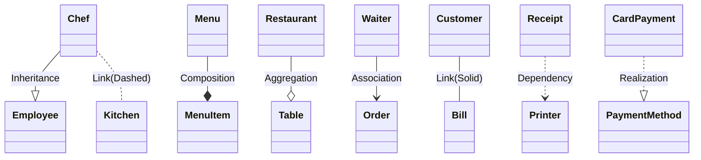
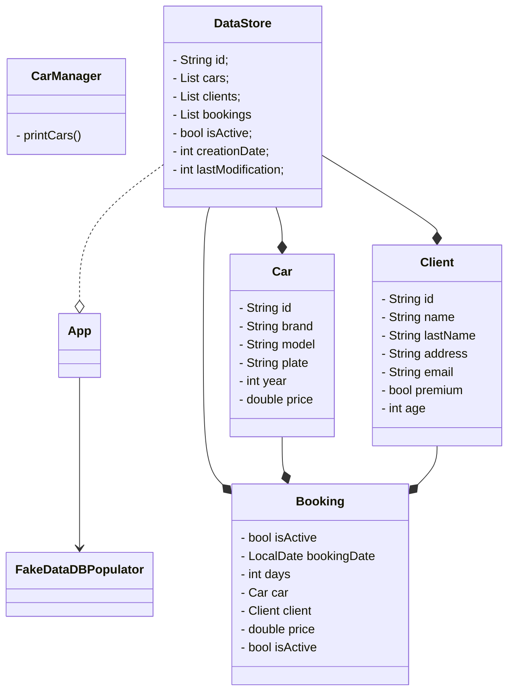

# rentingCar v1

`version document: v1.6`

## Goal & Summary

> Rent a car by CLI with client, car, init and ending date, price

- Reference project: [GitHub - AlbertProfe/restaurant](https://github.com/AlbertProfe/restaurant)
- `Epoch` code sandbox: [rentingCarTest/docs/epochSandbox.md at master · GitHub](https://github.com/AlbertProfe/rentingCarTest/blob/master/docs/masterdocappends/epochSandbox.md)
- How to name classes, example: [rentingCarTest/docs/namingTheLoopClass. · GitHub](https://github.com/AlbertProfe/rentingCarTest/blob/master/docs/masterdocappends/namingTheLoopClass.md)
- `Records` in Java from Java 14:
  - [Java Record Keyword | Baeldung](https://www.baeldung.com/java-record-keyword)
  - [Record Classes](https://docs.oracle.com/en/java/javase/17/language/records.html)

## Version

- [rentingCarTest/docs/rentingCar-sprints.md at master · AlbertProfe/rentingCarTest · GitHub](https://github.com/AlbertProfe/rentingCarTest/blob/master/docs/masterdocappends/rentingCar-sprints.md)

## Debt Tech & Efficiency

- v1.5.0: MainDispatcher too much coupled: view + bussines logic

- v1.5.0: MainDispatcher: elseif vs. Switch

- v1.5.0 add UUID: 
  
  - [UUID (Java Platform SE 8 )](https://docs.oracle.com/javase/8/docs/api/java/util/UUID.html)
  
  - [random - Create a GUID / UUID in Java - Stack Overflow](https://stackoverflow.com/questions/2982748/create-a-guid-uuid-in-java)

- Handle errors at input data `scanner` and arrays
  
  - Add try and catch
  
  - Add control index out of bounds in arrays

## UML Data Model

#### CLASS Car

```java
ackage org.example;

public class Car {
    private String id;
    private String brand;
    private String model;
    private String plate;
    private int year;
    private double price;

    // constructor, geters, setters, methods and toString

    private int carAge ()
}
```

#### CLASS Client & MinimalClient

```java
public class Client {

    private String id;
    private String name;
    private String lastName;
    private String address;
    private String email;
    private boolean premium;
    private int age;
    private String password;

    // constructor, geters, setters, methods and toString
}


public class MinimalClient {

    private String email;
private String password;

    public MinimalClient() {
    }

    // constructor, geters, setters, methods and toString
}
```

#### CLASS Booking

```java
public class Booking {

    private String id;
    //private Client client;
    private Car car;
    private int days;
    private double price;
    private boolean isActive;
    // private LocalDate bookingDate

    // constructor, geters, setters, methods and toString
}
```

#### CLASS DataStore

This is a draft, we wil not use `final` so far, and `static` will be reserved just for the **Lists**.

```java
public class DataStore {

    private String id;
    private List<Car> cars;
    private static List<Client> clients;
    private static List <Booking> bookings
    private boolean isActive;
    private int creationDate;
    private int lastModification;

    // constructor, geters, setters, methods and toString
}
```

## Why MinimalClient is used in ClientManager

- **Focused login data model**  
  MinimalClient (in src/main/java/org/example/model/MinimalClient.java) only carries `email` and `password`, which are the only fields needed for authentication.

- **Separation of concerns**  
  In ClientManager.loginClient(...) (src/main/java/org/example/managers/ClientManager.java), the UI layer `LoginView.showLoginView(scanner)` returns a MinimalClient. This decouples the login input from the full Client domain model.

- **Security and privacy**  
  Avoids passing around full Client objects (with id, name, address, etc.) when unnecessary, reducing exposure of personal data during the login flow.

- **Simpler validation**  
  ClientManager.validateLogin(MinimalClient, DataStore) compares minimalClient.getEmail() and minimalClient.getPassword() against stored Client records, keeping validation logic straightforward.

- **Lightweight DTO for the view**  
  Acts as a small, serializable DTO between `LoginView` and ClientManager, improving testability and reducing coupling to Client.

Where it’s used

- `ClientManager`.`loginClient(DataStore, Scanner)`
  - Gets MinimalClient from `LoginView.showLoginView(scanner)`.
  - Calls validateLogin(minimalClient, myDataStore) to find a matching Client.
  - On success, sets the logged-in Client via `myDataStore.setLoggedClient(validatedClient)`.

## Final & static

> Declaring lists as `final static` in Java means each list is a single, unchangeable reference shared by the entire class, not by individual objects. The content of the list itself can be modified (items can be added or removed), but the list variable can't be reassigned to another list instance.[stackoverflow+1](https://stackoverflow.com/questions/4525642/java-final-arraylist)

#### Why Use `final static` Lists?

- **static**: The field belongs to the class, not to any object, so all objects share the same list.[stackoverflow](https://stackoverflow.com/questions/1415955/private-final-static-attribute-vs-private-final-attribute)

- **final**: The reference to the list can't change (no `list = new ArrayList<>()` after assignment), but the contents can change (e.g., `list.add(obj)` is allowed).[geeksforgeeks+1](https://www.geeksforgeeks.org/java/final-arrays-in-java/)

- This pattern is typical for shared resources or pre-defined, class-wide collections (such as shared configuration data).

Summary Table

| Modifier                  | What it means                                                                                                                                             | Effect on List           |
| ------------------------- | --------------------------------------------------------------------------------------------------------------------------------------------------------- | ------------------------ |
| `static List<Type>`       | One list shared by the entire class[stackoverflow](https://stackoverflow.com/questions/1415955/private-final-static-attribute-vs-private-final-attribute) | All objects see the same |
| `final List<Type>`        | Can't assign the variable again[stackoverflow](https://stackoverflow.com/questions/4525642/java-final-arraylist)                                          | List contents mutable    |
| `static final List<Type>` | Shared by class, reference unchangeable                                                                                                                   | Contents mutable         |

So, `final static List<Car> cars` means all code sees the same, unchangeable list object reference for all time—but the list can still hold/release different `Car` elements unless further steps (like `Collections.unmodifiableList`) are used to make it truly immutable.[stackoverflow+1](https://stackoverflow.com/questions/9285011/declaring-an-arraylist-object-as-final-for-use-in-a-constants-file)

## Syntetic data & fake objects

- [GitHub - DiUS/java-faker: Brings the popular ruby faker gem to Java](https://github.com/DiUS/java-faker)

> This library is a port of Ruby's [faker](https://github.com/stympy/faker) gem (as well as Perl's Data::Faker library) that generates fake data. It's useful when you're developing a new project and need some pretty data for showcase.

Usage

In pom.xml, add the following xml stanza between `<dependencies> ... </dependencies>`

```xml
<dependency>
    <groupId>com.github.javafaker</groupId>
    <artifactId>javafaker</artifactId>
    <version>1.0.2</version>
</dependency>
```

Code example:

```java
Faker faker = new Faker();

String name = faker.name().fullName(); // Miss Samanta Schmidt
String firstName = faker.name().firstName(); // Emory
String lastName = faker.name().lastName(); // Barton

String streetAddress = faker.address().streetAddress(); // 60018 Sawayn Brooks Suite 449
```

## UML

Here are very brief, concrete `restaurant-related` examples for each **UML** class diagram relationship in [Class diagrams | Mermaid](https://mermaid.js.org/syntax/classDiagram.html):

- **Inheritance (Generalization):**  
  Chef --|> Employee  
  Chef is a type of Employee.

- **Composition:**  
  Menu --* MenuItem  
  Menu is composed of MenuItems; MenuItems can’t exist without the Menu.

- **Aggregation:**  
  Restaurant --o Table  
  Restaurant has Tables, but Tables can exist if the Restaurant is closed.

- **Association:**  
  Waiter --> Order  
  Waiter takes Orders.

- **Link (Solid):**  
  Customer -- Bill  
  Customer is directly connected to Bill, representing a specific interaction.

- **Dependency:**  
  Receipt ..> Printer  
  Receipt depends on Printer (uses it temporarily).

- **Realization:**  
  CardPayment ..|> PaymentMethod  
  CardPayment realizes (implements) PaymentMethod interface.

- **Link (Dashed):**  
  Chef .. Kitchen  
  Chef is loosely connected to Kitchen (less specific/weak association).



### UML Renting Car



## Epoch & Unix time java

- https://www.epochconverter.com/

What is epoch time?

> The **Unix epoch** (or **Unix time** or **POSIX time** or **Unix timestamp**) is the number of seconds that have elapsed since January 1, 1970 (midnight UTC/GMT), not counting leap seconds (in ISO 8601: 1970-01-01T00:00:00Z). Literally speaking, the epoch is Unix time 0 (midnight 1/1/1970), but 'epoch' is often used as a synonym for Unix time. Some systems store epoch dates as a signed 32-bit integer, which might cause problems on January 19, 2038 (known as the Year 2038 problem or Y2038). The converter on this page converts timestamps in seconds (10-digit), milliseconds (13-digit) and microseconds (16-digit) to readable dates.

| Human-readable time  | Seconds          |
| -------------------- | ---------------- |
| 1 hour               | 3600 seconds     |
| 1 day                | 86400 seconds    |
| 1 week               | 604800 seconds   |
| 1 month (30.44 days) | 2629743 seconds  |
| 1 year (365.24 days) | 31556926 seconds |

**How to get the current epoch time in Java**

- `long epoch = System.currentTimeMillis()/1000;` Returns epoch in seconds.

- `long epoch = System.currentTimeMillis();` Returns epoch in miliseconds.

## CLI UI

```shell
Starting code...

Chose an option (0 to quit):
0. Quit
1. Tests
2. List Cars
3. Login Client
4. Make a booking


Option?
```

## Tech Stack

- IDE: IntelliJ IDEA 2025.1.3 (Community Edition)
  
  - [Descargar IntelliJ IDEA](https://www.jetbrains.com/es-es/idea/download/?section=linux)
  
  - With [Installing snap on Ubuntu | Snapcraft documentation](https://snapcraft.io/docs/installing-snap-on-ubuntu): `sudo snap install intellij-idea-community --classic`

- Java 21 (or 25, 17, 11, 8)

- JUniit 3.8.1

- Maven Project: **`maven-archetype-quickstart` archetype**
  
  - https://maven.apache.org/
  
  - mvn --version
    Apache Maven 3.8.7
    Maven home: /usr/share/maven
    Java version: 21.0.8, vendor: Ubuntu, runtime: /usr/lib/jvm/java-21-openjdk-amd64
    Default locale: en_US, platform encoding: UTF-8
    OS name: "linux", version: "6.8.0-83-generic", arch: "amd64", family: "unix"

## POM.XML

```xml
<project xmlns="http://maven.apache.org/POM/4.0.0" xmlns:xsi="http://www.w3.org/2001/XMLSchema-instance"
  xsi:schemaLocation="http://maven.apache.org/POM/4.0.0 http://maven.apache.org/xsd/maven-4.0.0.xsd">
  <modelVersion>4.0.0</modelVersion>

  <groupId>org.example</groupId>
  <artifactId>rentingCarTest</artifactId>
  <version>1.0-SNAPSHOT</version>
  <packaging>jar</packaging>

  <name>rentingCarTest</name>
  <url>http://maven.apache.org</url>

  <properties>
    <project.build.sourceEncoding>UTF-8</project.build.sourceEncoding>
  </properties>

  <dependencies>
    <!-- JUnit: tool to test  -->
    <dependency>
      <groupId>junit</groupId>
      <artifactId>junit</artifactId>
      <version>3.8.1</version>
      <scope>test</scope>
    </dependency>

    <!-- Java Faker: fake data creation -->
    <dependency>
      <groupId>com.github.javafaker</groupId>
      <artifactId>javafaker</artifactId>
      <version>1.0.2</version>
    </dependency>

  </dependencies>
</project>
```
